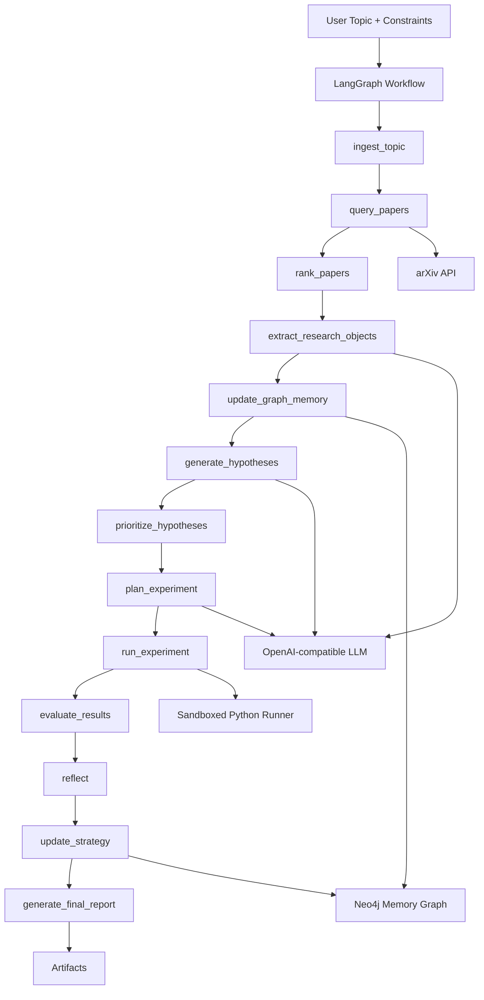

# Research Forge

**A universal self-improving AI research agent that discovers papers, builds a structured research memory, generates and tests hypotheses, and adapts its reasoning strategy across research cycles.**

Research Forge is a production-style MVP for automated scientific and technical research workflows across arbitrary topics (`LLM evaluation`, `graph neural networks`, `anomaly detection`, `protein folding`, `query optimization`, etc.).

## What It Does

- Discovers papers from arXiv for a user topic
- Extracts structured research objects from papers (not just summaries)
- Generates and prioritizes testable hypotheses
- Plans and runs lightweight sandboxed experiments when feasible
- Evaluates outcomes and updates long-term strategy memory
- Writes Markdown and JSON run artifacts
- Optionally persists memory in Neo4j

## Core Stack

- Python
- LangGraph (workflow orchestration)
- arXiv API
- OpenAI-compatible chat model
- Neo4j (optional long-term graph memory)
- Streamlit (demo UI)
- Pydantic (validation)

## Architecture



## Project Layout

```text
app.py
config.py
requirements.txt
README.md
.env.example
sample_config.yaml

agent/
tools/
schemas/
memory/
ui/
tests/
examples/
docs/
```

## Quickstart (Level 1)

1. Open terminal in project root:
   ```powershell
   cd "D:\Projects\Research Forge"
   ```

2. Create and activate virtual environment:
   ```powershell
   python -m venv .venv
   .\.venv\Scripts\Activate.ps1
   ```

3. Install dependencies:
   ```powershell
   pip install -r requirements.txt
   ```

4. Create `.env`:
   ```powershell
   Copy-Item .env.example .env
   ```

5. Edit `.env`:
   - Required: `OPENAI_API_KEY`
   - Keep: `ARXIV_API_URL=https://export.arxiv.org/api/query`
   - Neo4j is optional. Leave `NEO4J_*` empty if not using graph memory.

6. Run CLI:
   ```powershell
   .\.venv\Scripts\python.exe app.py --topic "LLM evaluation" --max-papers 12 --categories "cs.CL,cs.LG" --experiment-budget 2
   ```

7. View outputs:
   - `artifacts/<run_id>/research_report.md`
   - `artifacts/<run_id>/research_report.json`

8. Run Streamlit UI:
   ```powershell
   .\.venv\Scripts\python.exe -m streamlit run ui/streamlit_app.py
   ```

## Neo4j Modes

- No Neo4j (recommended for first run):
  - Set `NEO4J_URI=`, `NEO4J_USER=`, `NEO4J_PASSWORD=`, `NEO4J_DATABASE=`
- Neo4j enabled:
  - Set all `NEO4J_*` fields correctly for local or Aura
  - Validate runtime settings:
    ```powershell
    .\.venv\Scripts\python.exe -c "from config import get_settings; s=get_settings(); print(s.neo4j_uri, s.neo4j_database, s.neo4j_enabled)"
    ```

## Streamlit Notes

- First launch may show Streamlit onboarding prompt (normal).
- Run from project root.
- If the script was already running, stop with `Ctrl+C` and restart.

## Testing

```powershell
.\.venv\Scripts\python.exe -m pytest tests -q
```

## Example Topics

See [examples/example_topics.md](examples/example_topics.md).

## Troubleshooting

See [docs/TROUBLESHOOTING.md](docs/TROUBLESHOOTING.md).

## Limitations

- Uses arXiv metadata/abstracts, not full PDF parsing
- Sandboxed execution is best-effort and intended for lightweight tests
- Some hypotheses/experiment plans may be theoretical-only based on feasibility checks

## Roadmap

- Full-text parsing and citation graph enrichment
- Expanded experiment template library by modality/domain
- Multi-run strategy analytics dashboard
