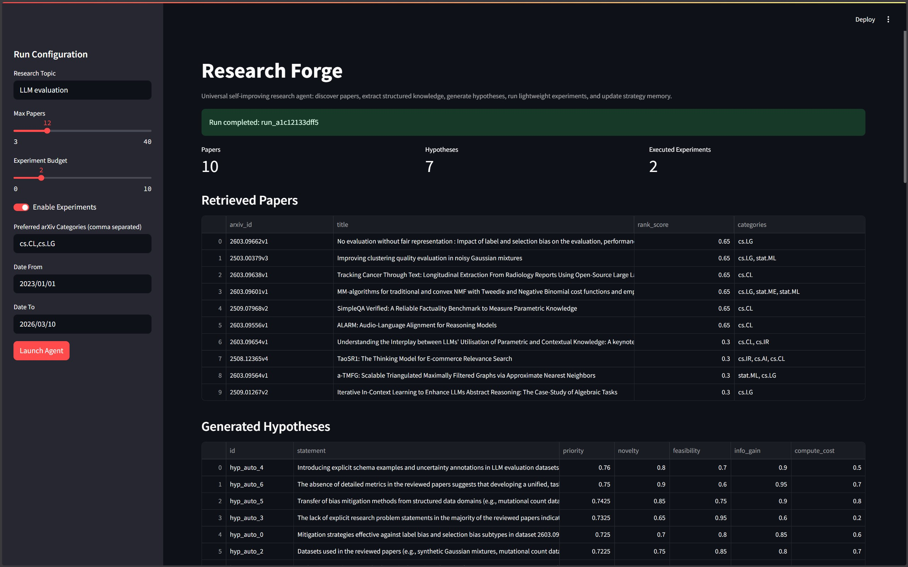
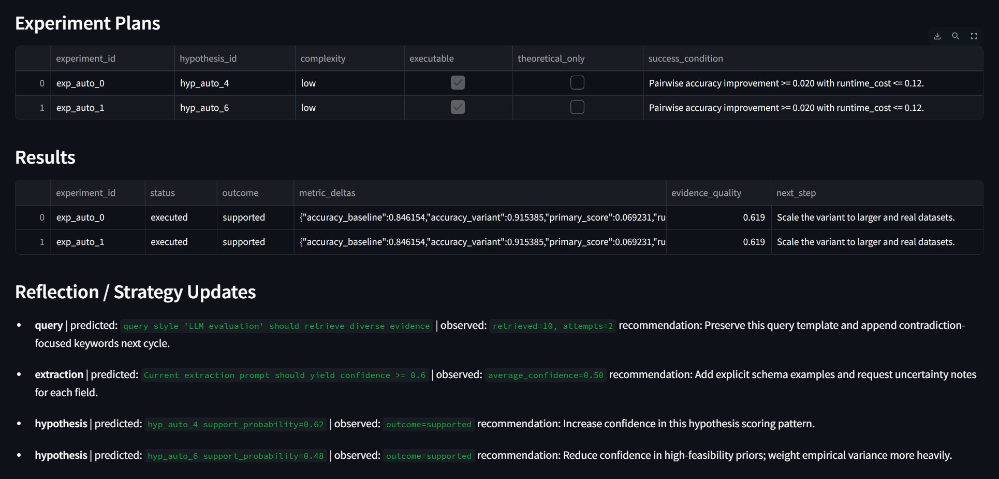
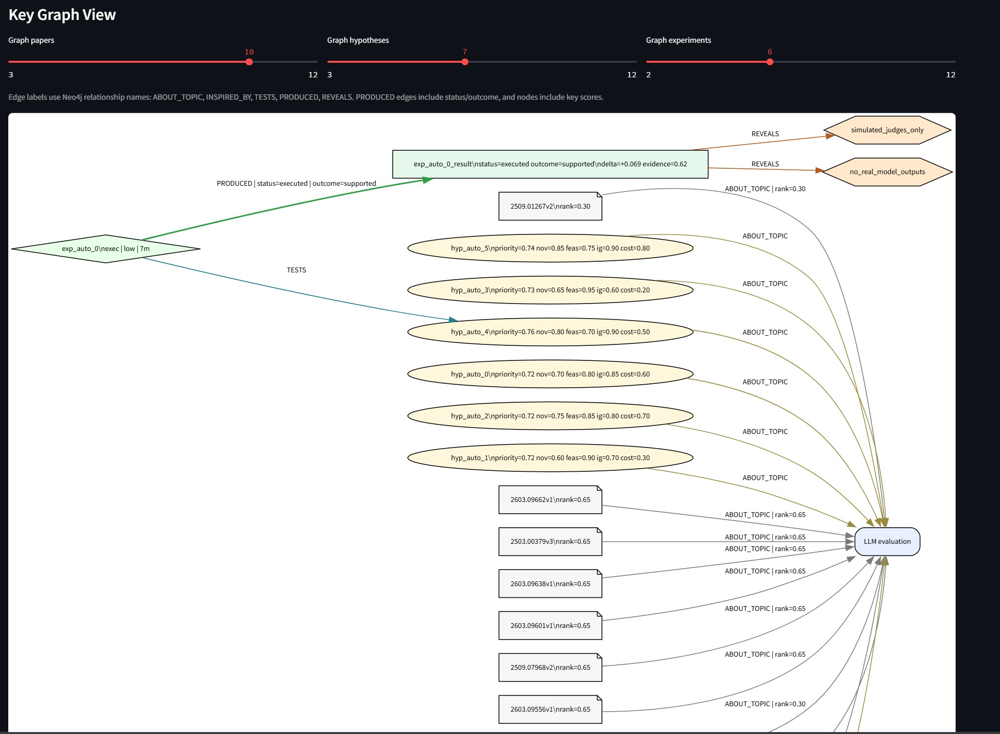
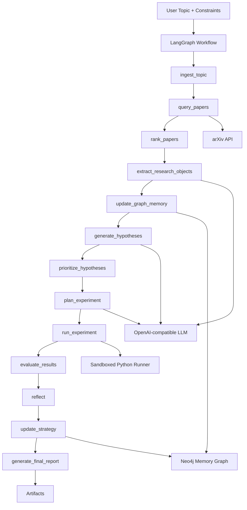

# Research Forge

**A universal self-improving AI research agent that discovers papers, builds a structured research memory, generates and tests hypotheses, and adapts its reasoning strategy across research cycles.**

Research Forge is a production-style MVP for automated scientific and technical research workflows across arbitrary topics such as `LLM evaluation`, `graph neural networks`, `anomaly detection`, `time series forecasting`, `protein folding`, and `database query optimization`.

## UI Screenshots

<table>
  <tr>
    <td align="center" width="50%">
      
      <br />
      <sub><b>Run Configuration, Retrieved Papers, Generated Hypotheses</b></sub>
    </td>
    <td align="center" width="50%">
      
      <br />
      <sub><b>Experiment Plans, Results, Reflection / Strategy Updates</b></sub>
    </td>
  </tr>
  <tr>
    <td align="center" width="50%">
      
      <br />
      <sub><b>Key Graph View</b></sub>
    </td>
    <td align="center" width="50%">
      <br />
    </td>
  </tr>
</table>

## What This Project Does

- Accepts an arbitrary research topic and optional constraints.
- Queries arXiv, deduplicates results, and ranks papers by relevance plus recency.
- Converts papers into structured machine-usable objects instead of plain summaries.
- Generates grounded, falsifiable hypotheses.
- Prioritizes hypotheses using explicit score dimensions.
- Plans lightweight experiments and auto-generates runnable proxy experiments for lightweight topics when possible.
- Executes safe local Python experiments in a sandbox.
- Evaluates outcomes, records confounders, and proposes next steps.
- Persists research memory in Neo4j when configured.
- Stores reflection-driven strategy updates in Neo4j and in a local cache so later runs can adapt.
- Produces Markdown and JSON artifacts for every run.
- Exposes a Streamlit UI for interactive use.

## Why It Is Novel

Research Forge is not just a paper summarizer. It treats research as a loop:

1. Discover evidence.
2. Structure evidence.
3. Generate hypotheses.
4. Test feasible hypotheses.
5. Evaluate what happened.
6. Update strategy memory for later cycles.

That makes it a universal research-agent prototype rather than a one-shot literature assistant.

## Core Stack

- Python
- LangGraph
- arXiv Atom API
- OpenAI-compatible LLM API
- Neo4j
- Streamlit
- Pydantic

## Architecture Overview



## Documentation Map

This README is the entry point. The detailed system documentation lives in focused files:

- [Getting started, setup, configuration, and running the project](docs/GETTING_STARTED.md)
- [Workflow, architecture, repo layout, and execution model](docs/ARCHITECTURE.md)
- [Neo4j graph memory, self-improvement loop, and persistence model](docs/MEMORY_AND_LEARNING.md)
- [Scoring, experiments, sandbox behavior, outputs, and field definitions](docs/SCORING_AND_EXPERIMENTS.md)
- [Troubleshooting common runtime issues](docs/TROUBLESHOOTING.md)
- [Example topics](examples/example_topics.md)
- [Illustrative sample run output](examples/sample_run_output.md)

## Quickstart

1. Open a terminal in the project root:
   ```powershell
   cd "D:\Projects\Research Forge"
   ```
2. Create and activate a virtual environment:
   ```powershell
   python -m venv .venv
   .\.venv\Scripts\Activate.ps1
   ```
3. Install dependencies:
   ```powershell
   pip install -r requirements.txt
   ```
4. Create `.env` from the template:
   ```powershell
   Copy-Item .env.example .env
   ```
5. Put your `OPENAI_API_KEY` in `.env`.
6. Run the CLI:
   ```powershell
   .\.venv\Scripts\python.exe app.py --topic "LLM evaluation" --max-papers 12 --categories "cs.CL,cs.LG" --experiment-budget 2
   ```
7. Run the UI:
   ```powershell
   .\.venv\Scripts\python.exe -m streamlit run ui/streamlit_app.py
   ```

## High-Level Workflow

1. `ingest_topic`
   Loads prior strategy hints and related concepts from memory.
2. `query_papers`
   Builds arXiv queries, handles fallback query styles, and retrieves candidate papers.
3. `rank_papers`
   Computes `relevance_score`, `recency_score`, and `rank_score`.
4. `extract_research_objects`
   Produces structured research objects for each paper using the LLM with heuristic fallback.
5. `update_graph_memory`
   Writes papers and extraction entities into Neo4j when enabled.
6. `generate_hypotheses`
   Generates grounded hypotheses from extracted evidence and prior strategy hints.
7. `prioritize_hypotheses`
   Converts raw hypothesis attributes into a `priority_score` and prediction objects.
8. `plan_experiment`
   Produces experiment plans, and upgrades theoretical lightweight plans into runnable proxy experiments when appropriate.
9. `run_experiment`
   Executes safe snippets in an isolated Python subprocess when allowed.
10. `evaluate_results`
    Converts raw metrics into `supported`, `unsupported`, or `inconclusive` outcomes.
11. `reflect`
    Compares predictions to outcomes and generates explicit strategy updates.
12. `update_strategy`
    Persists strategy updates to Neo4j and local cache.
13. `generate_final_report`
    Writes Markdown and JSON artifacts and derives next research ideas.

## What Gets Produced Per Run

- A Markdown report in `artifacts/<run_id>/research_report.md`
- A JSON artifact in `artifacts/<run_id>/research_report.json`
- Ranked papers with scores
- Structured hypotheses with scores
- Experiment plans
- Experiment results
- Reflection notes
- Strategy updates
- Next research ideas
- Optional Neo4j graph updates

## Repository Layout

```text
app.py                         CLI entry point
config.py                      Environment-driven settings
requirements.txt               Python dependencies
.env.example                   Example configuration
sample_config.yaml             Example config payload

agent/
  graph.py                     LangGraph orchestration
  state.py                     Shared run state model
  prompts.py                   Reusable LLM prompts
  nodes/                       Workflow nodes

tools/
  arxiv_client.py              arXiv discovery + retry/backoff handling
  llm_client.py                OpenAI-compatible structured output wrapper
  neo4j_store.py               Graph memory persistence
  python_runner.py             Sandboxed Python executor
  ranker.py                    Paper ranking logic
  report_writer.py             Markdown/JSON artifact writer

schemas/
  paper.py                     Paper metadata + ranking fields
  extraction.py                Structured paper understanding schema
  hypothesis.py                Hypothesis schema and scoring fields
  experiment.py                Experiment plan schema
  result.py                    Experiment result schema
  strategy.py                  Strategy update schema
  run_report.py                Request/constraints/report schemas

memory/
  graph_queries.py             Reusable Cypher snippets
  retrieval.py                 Memory retrieval helpers
  strategy_memory.py           Strategy persistence in Neo4j + local cache

ui/
  streamlit_app.py             Streamlit interface and graph view

tests/
  test_*.py                    Basic unit coverage for schemas, ranking, arXiv, runner, planner

docs/
  *.md                         Detailed project documentation
```

## Neo4j Support

Neo4j is optional.

- If `NEO4J_URI`, `NEO4J_USER`, and `NEO4J_PASSWORD` are empty, the system runs without graph writes.
- If Neo4j is configured, papers, extraction entities, hypotheses, experiments, results, research ideas, and strategy updates are persisted.
- A local JSON strategy cache is still used even when Neo4j is disabled.

## Key Design Principles

- Universal topic handling instead of domain hardcoding
- Structured reasoning over free-form summaries
- Explicit memory and reflection across runs
- Lightweight execution only when local testing is realistic
- Graceful degradation when APIs or infrastructure are unavailable
- Serious startup-style modular architecture rather than a notebook demo

## Limitations

- The system currently relies on arXiv metadata and abstracts rather than full PDF parsing.
- LLM extraction and hypothesis scores are not ground-truth calibrated scientific judgments.
- Local experiments are intentionally lightweight and often proxy-style rather than full reproductions.
- Heavy scientific domains can remain theoretical-only when safe local execution would be misleading.
- The Streamlit graph view is a run-level visualization, not a full Neo4j graph browser.

## Roadmap

- Full-text parsing and richer citation-aware retrieval
- Better domain-specific proxy experiment families
- Stronger cross-run memory retrieval and strategy analytics
- More complete Neo4j exploration views in the UI
- Richer test coverage for end-to-end pipeline behavior
