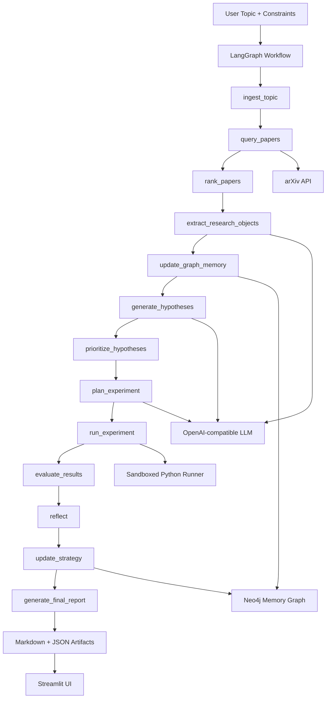

# Research Forge

**A universal self-improving AI research agent that discovers papers, builds a structured research memory, generates and tests hypotheses, and adapts its reasoning strategy across research cycles.**

Research Forge is a production-style MVP for automated scientific and technical research workflows.  
It is designed to operate across arbitrary topics (`LLM evaluation`, `graph neural networks`, `anomaly detection`, `protein folding`, `query optimization`, etc.) without hardcoding a domain.

## Why This Is Different

Most research assistants stop at summarization. Research Forge is built around:

- Structured extraction into machine-usable objects, not only prose
- Hypothesis generation grounded in evidence and contradictions
- Lightweight experiment planning and sandboxed execution
- Explicit post-run reflection on predicted vs observed outcomes
- Persistent strategy memory that influences future runs

## Core Stack

- Python
- LangGraph (workflow orchestration)
- arXiv API (paper discovery)
- Neo4j (long-term graph memory; optional but fully supported)
- OpenAI-compatible LLM interface
- Sandboxed Python execution for lightweight experiments
- Pydantic schemas for validation
- Streamlit demo UI

## Architecture Overview



## Graph Memory Schema (Neo4j)

Implemented node families include:

- `Paper`, `Author`, `Topic`, `Concept`
- `Dataset`, `Metric`, `Assumption`, `Limitation`, `Claim`
- `Hypothesis`, `Experiment`, `Result`, `FailureMode`, `StrategyUpdate`

Representative relationships:

- `Paper-[:ABOUT_TOPIC]->Topic`
- `Paper-[:AUTHORED_BY]->Author`
- `Paper-[:EVALUATED_ON]->Dataset`
- `Paper-[:MEASURES_WITH]->Metric`
- `Paper-[:DISCUSSES]->Concept`
- `Hypothesis-[:INSPIRED_BY]->Paper`
- `Experiment-[:TESTS]->Hypothesis`
- `Experiment-[:PRODUCED]->Result`
- `Result-[:REVEALS]->FailureMode`
- `StrategyUpdate-[:ABOUT_TOPIC]->Topic`

## Workflow Steps

1. `ingest_topic`: normalize request + load prior strategy hints
2. `query_papers`: retrieve papers from arXiv (with fallback query handling)
3. `rank_papers`: relevance + recency ranking and dedupe
4. `extract_research_objects`: structured extraction with schema validation
5. `update_graph_memory`: write papers/extractions into Neo4j
6. `generate_hypotheses`: produce grounded, testable hypotheses
7. `prioritize_hypotheses`: score by novelty, feasibility, information gain, compute cost
8. `plan_experiment`: create runnable or theoretical experiment plans
9. `run_experiment`: execute lightweight plans in sandbox
10. `evaluate_results`: classify support/unsupported/inconclusive
11. `reflect`: explicit predicted vs observed analysis
12. `update_strategy`: persist learning signals
13. `generate_final_report`: write markdown/json artifacts + next ideas

## Self-Improvement Mechanism

Research Forge stores strategy updates as structured memory entries, including:

- what was predicted
- what was observed
- failure/success reason
- recommendation for future runs
- confidence delta + impact score

Examples of concrete update patterns:

- Query strategy: broaden/narrow filters based on retrieval yield
- Extraction strategy: adjust prompts when confidence is low
- Hypothesis strategy: down-weight patterns with repeated misses
- Experiment strategy: prioritize low-cost high-signal templates

These updates are retrieved at the next run (`ingest_topic`) and influence generation decisions.

## Project Structure

```text
app.py
config.py
requirements.txt
README.md
.env.example
sample_config.yaml

agent/
  graph.py
  state.py
  prompts.py
  nodes/
    ingest_topic.py
    query_papers.py
    rank_papers.py
    extract_research_objects.py
    update_graph_memory.py
    generate_hypotheses.py
    prioritize_hypotheses.py
    plan_experiment.py
    run_experiment.py
    evaluate_results.py
    reflect.py
    update_strategy.py
    generate_final_report.py

tools/
  arxiv_client.py
  llm_client.py
  neo4j_store.py
  python_runner.py
  ranker.py
  report_writer.py

schemas/
  paper.py
  extraction.py
  hypothesis.py
  experiment.py
  result.py
  strategy.py
  run_report.py

memory/
  graph_queries.py
  strategy_memory.py
  retrieval.py

ui/
  streamlit_app.py

tests/
  test_schemas.py
  test_ranker.py
  test_runner.py

examples/
  example_topics.md
  sample_run_output.md
```

## Local Setup

1. Create and activate a virtual environment.
2. Install dependencies:
   ```bash
   pip install -r requirements.txt
   ```
3. Copy `.env.example` to `.env` and fill required values.
   - If Neo4j is not running locally, leave `NEO4J_URI`, `NEO4J_USER`, and `NEO4J_PASSWORD` empty.
   - Keep `ARXIV_API_URL` as `https://export.arxiv.org/api/query`.

## Run the Agent (CLI)

```bash
python app.py \
  --topic "LLM evaluation" \
  --max-papers 12 \
  --categories "cs.CL,cs.LG" \
  --experiment-budget 2
```

Artifacts are written under `artifacts/<run_id>/`.

## Run Streamlit UI

```bash
streamlit run ui/streamlit_app.py
```

## Example Topics / Prompts

See:

- `examples/example_topics.md`
- `sample_config.yaml`

## Testing

```bash
pytest tests -q
```

## Limitations (Current MVP)

- Uses arXiv metadata/abstracts, not full PDF parsing
- Sandboxed execution is best-effort and intended for lightweight local tests
- Theoretical plans are produced when execution is not feasible
- Real benchmark integration is not bundled by default

## Roadmap

- Add full-text parsing and citation graph enrichment
- Add dataset adapters (Hugging Face/OpenML/Kaggle loaders)
- Add richer contradiction mining across papers
- Add experiment template registry per modality (NLP/CV/tabular/systems)
- Add multi-run strategy dashboards and trend analytics
